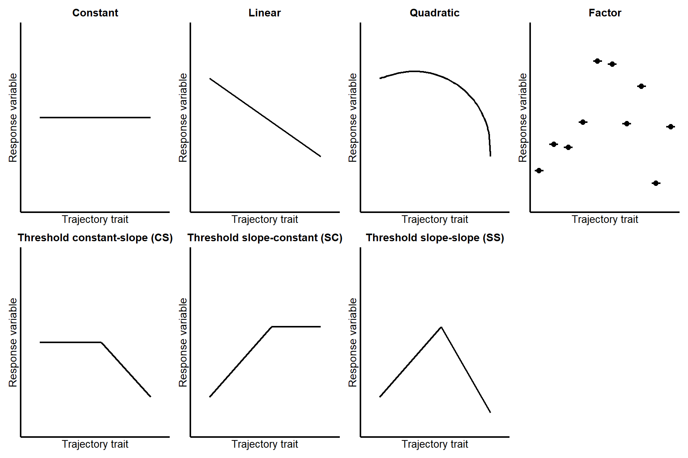

# selectools

<!-- badges: start -->
[](https://github.com/LucasDLalande/selectools/actions/workflows/R-CMD-check.yaml)
<!-- badges: end -->

The goal of `selectools` is to provide and facilitate model selection procedures, 
mostly based on AIC and AICc, and adapting the `MuMIn::dredge()` function. 
`selectools` can be viewed as a two-part package, with on one hand a full pipeline 
for trajectory analyses, and on the other hand an adaptation of `MuMIn::dredge()` for 
phylogenetic model. More specifically, the package contains:

- a set of function to perform trajectory analyses (`trajectory_formulas()`, 
`estimate_threshold()`, `fit_models()`, `dredge_trajectories()`, `best_trajectory()` 
and the wrapper function `select_trajectory()`).
It is designed for model selection from A to Z when testing different 
trajectories as can be done in senescence research, by automatically computing, fitting, 
testing, comparing and ranking constant, linear, quadratic, factor and threshold trajectories. 

- a function (`pglmm_dredge()`) to perform model selection of phylogenetic generalized 
linear mixed models (`phyr::pglmm()`). It generates a model selection table of 
models as would do the `MuMIn::dredge()` with combinations (subsets) of fixed effect 
terms in the global model, with optional model inclusion rules.

## Installation

You can install the development version of `selectools` from [GitHub](https://github.com/LucasDLalande/selectools) with:

``` r
install.packages("remotes")
remotes::install_url(
  "https://github.com/LucasDLalande/selectools/archive/refs/heads/master.zip"
)
```

## Usage
### I. Trajectory analysis pipeline
The package contains a full pipeline for trajectory analyses.

#### 1) Build formulas for selected trajectories: `trajectory_formulas()`

From a base formula, automatically build formulas for all desired trajectories among 
constant, linear, quadratic, factor and threshold trajectories (see below and note 
that slopes or curvatures can be of any sign).



Define your formula structure (`formula`), excluding the trait for which different 
trajectories should be tested (`trajectory_trait`). Define terms interacting with 
`trajectory_trait` (`interactions`). Provide the data.frame containing all variables 
described in `formula`, `trajectory_trait` and `interactions`. Finally, define which
trajectories should be built (`trajectories`, defaults to `"all"` but choose among 
`"constant"`, `"linear"`, `"quadratic"`, `"factor"` - or `"non-threshold"` for all four 
non-threshold trajectories -, `"thresholdCS"`, `"thresholdSC"`, `"thresholdSS"` - or 
`"threshold"` for all three threshold trajectories).
```r
trajectory_formulas(
  formula, 
  trajectory_trait, 
  interactions = NULL, 
  data, 
  trajectories = "all"
)

# Print S3 method
print(x, ...)
```
It returns an object of class `trajectory.formulas` containing all trajectory 
formulas selected.

#### 2) Estimate threshold point for threshold trajectories: `estimate_threshold()`

Based on threshold trajectory formulas, estimate the best threshold point according 
to AIC or AICc value (`rank`) as described in Briga et al. (2019), Douhard et al. (2017) 
or Lalande et al. (2024).

`threshold_formulas` takes either the `trajectory.formulas` object generated by 
`trajectory_formulas()` or a named list of threshold formula object (see examples).
`start`, `end`, `iter` specifies where to start, end and how to increment threshold point tests.
`lmer_control` should ideally stay `NULL` (default). If no random effects, then 
`lmer_control` is `NULL`, otherwise it refers to the internal object `lmerControl_default` 
which uses Bound Optimization BY Quadratic Approximation, "bobyqa" and 1e5 as 
maximal number of evaluation Advanced users can supply custom optimizer controls 
for `lmerMod` class objects. 
```r
estimate_threshold(
  data,
  threshold_formulas,
  trajectory_trait,
  start,
  end,
  iter,
  rank = c("AICc", "AIC"),
  lmer_control = NULL
)

# Print S3 method
print(x, ...)

# Plot S3 method
plot(x, model = c("thresholdCS", "thresholdSC", "thresholdSS"))
```
Returns a `threshold.estimation` object containing a list of the best threshold point
for each threshold trajectory.

The plot S3 method allow to consult plots of AIC/AICc values according to threshold values 
for each trajectory.

References

>  Briga, M., Jimeno, B. & Verhulst, S. (2019). Coupling lifespan and aging? The
 age at onset of body mass decline associates positively with sex-specific lifespan
 but negatively with environment-specific lifespan. *Experimental Gerontology*,
 119, 111-119. [10.1016/j.exger.2019.01.030](https://doi.org/10.1016/j.exger.2019.01.030)

> Douhard, F., Gaillard, J.-M., Pellerin, M., Jacob, L. & Lemaître, J.-F. (2017).
 The cost of growing large: Costs of post-weaning growth on body mass senescence
 in a wild mammal. *Oikos*, 126, 1329–1338. [10.1111/oik.04421](https://doi.org/10.1111/oik.04421)

> Lalande, L. D., Bourgoin, G., Carbillet, J., Cheynel, L., Debias, F., Ferté, H.,
 Gaillard, J., Garcia, R., Lemaître, J., Palme, R., Pellerin, M., Peroz, C., Rey, B.,
 Vuarin, P. and Gilot-Fromont, E. (2024). Early-life glucocorticoids accelerate
 lymphocyte count senescence in roe deer. *General and Comparative Endocrinology*,
 357, 114595. [10.1016/j.ygcen.2024.114595](https://doi.org/10.1016/j.ygcen.2024.114595)

#### 3) Fit models: `fit_models()`

Fits `lme4::lmer()` or `stats::lm()` models for all trajectories, accounting for threshold 
estimations obtained by `estimate_threshold()`.

`formulas` takes either the `trajectory.formulas` object generated by `trajectory_formulas()` 
or a named list of formula object to be tested (see examples). If `formulas` includes 
threshold formulas, `best_thresholds` takes either a `threshold.estimation` object 
obtained with `estimate_threshold()` or a named list of numeric values specifying 
threshold points (see examples).
```r
fit_models(
  formulas, 
  trajectory_trait, 
  data, 
  best_thresholds = NULL, 
  lmer_control = NULL
)

# Print S3 method
print(x, ...)
```
Returns a `models` object containing all trajectory model fits and an attached 
environment with threshold datasets (*i.e.* copies of `data` with `trajectory_trait` 
recalculated according to threshold points).

#### 4) Apply dredge method on fitted models: `dredge_trajectories()`

This function applies the `MuMIn::dredge()` function to each model trajectory.
For each trajectory (constant, linear, quadratic, factor, thresholds), the function
selects the best model based on criterion (`rank`: `"AIC"` or `"AICc"`) value.

`models` is an object generated by `fit_models()`, exclusively. `delta_criterion` 
is a numeric value that is used to select the subset of best models. The best model 
is selected as the model with the lowest number of parameters (df) among models below 
delta_criterion (either delta_AICc or delta_AIC). Delta is the difference between 
the criterion (AIC or AICc) value of a given model, and the criterion of the model with 
the lowest criterion value.
```r
dredge_trajectories(
  models, 
  trajectory_trait, 
  rank = c("AIC", "AICc"), 
  delta_criterion = 2, 
  data
)
```
Returns a `dredge.results` object containing `model.selection` tables (either complete, 
subset below `delta_criterion` or best model).

#### 5) Best trajectory selection: `best_trajectory()`

Based on dredge results, the function selects the final retained trajectory by comparing 
the retained models for each trajectory according to their number of parameters 
and AIC or AICc values.

`dredge_results` is a `dredge.results` object obtained with `dredge_trajectories()`, 
exclusively. `adjust_threshold` is a logical argument stating whether 1 number of parameters 
and 2 AICc/AIC values should be added for threshold models to account for the implicit cost 
of the threshold parameter (defaults to `TRUE`).

```r
best_trajectory(
  dredge_results, 
  delta_criterion = 2, 
  adjust_threshold = TRUE
)
  
# Print S3 method
## prints a recap of the best trajectory (type = "global") or the best model of 
## each trajectory (type = "by_trajectory")
print(x, type = c("global", "by_trajectory"))

# Summary S3 method
## prints a summary of the best model trajectory (type = "global") or the best model of 
## each trajectory (type = "by_trajectory")
summary(x, type = c("global", "by_trajectory"))
```
Returns a `best.trajectory` object containing recap and summary information of 
selected trajectory.

#### Wrapper function: `select_trajectory()`

This function is a wrapper allowing to run in one command the whole pipeline 
described above. 

All arguments have been described above.

```r
select_trajectory(
  formula,
  trajectory_trait,
  interactions = NULL,
  data,
  trajectories = "all",
  start, end, iter,
  rank = c("AICc", "AIC"),
  delta_criterion = 2,
  adjust_threshold = TRUE,
  lmer_control = NULL
)

# Print S3 method
## prints a recap of the best trajectory (type = "global") or the best model of 
## each trajectory (type = "by_trajectory")
print(x, type = c("global", "by_trajectory"))

# Summary S3 method
## prints a summary of the best model trajectory (type = "global") or the best model of 
## each trajectory (type = "by_trajectory")
summary(x, type = c("global", "by_trajectory"))
```
Returns a `best.trajectory` object containing recap and summary information of 
selected trajectory.

### II. Phylogenetic model selection
The package contains the `dredge_pglmm()` function:

Define your random effects (`formulaRE`), fixed effects (`fixed`), data, 
model selection criterion (AIC or AICc), distribution family (gaussian , binomial or poisson), 
the covariance matrix of the random effects (`cov_ranef`, *i.e.* usually an object of class `phylo`)
and whether to display estimates and/or standard-errors.
``` r
dredge_pglmm(
  formulaRE,
  fixed,
  data,
  rank = c("AICc", "AIC"),
  family = c("gaussian", "binomial", "poisson"),
  cov_ranef,
  estimate = T,
  std.err = F,
  round = 3
)

# Print S3 method
print(x, ...)
```
It returns a `dredge.table` object containing a data frame with ordered models 
and respective fixed effects structure (and estimates and/or standard-errors), 
based on AIC or AICc.

## Example
### Trajectory analysis pipeline

This is a basic example of how to use all functions of the pipeline, using 
simulated package data.

```r
# trajectory_formulas()
## Provide a base formula, the trait of interest, its interactions, data and the trajectories desired
formulas <- trajectory_formulas(
  formula = log_onset ~ log_mass + (1|Species),
  trajectory_trait = "log_afr", 
  interactions = "log_mass",
  data = senescence,
  trajectories = c("linear", "quadratic", "thresholdCS")
)

## print s3 method
formulas
                               
# estimate_threshold()
## Pass an object of class "trajectory_formulas" to estimate_threshold()
est <- estimate_threshold(
  data = senescence, 
  threshold_formulas = formulas,
  trajectory_trait = "log_afr", 
  start = -0.5, end = 5.7, iter = 0.1,
  rank = "AICc"
)

## print s3 method
formulas

## plot s3 method
plot(formulas, model = "thresholdCS") # display plots of AIC/AICc ~ threshold value
                   
## Or pass a named list to estimate_threshold()
# Names must be chosen from "thresholdCS", "thresholdSC" and "thresholdSS"
# The trajectory trait must have the suffix ".2" if the slope is after the 
# threshold, and ".1" if the slope is before the threshold.
formulas_manual <- list(
  thresholdCS = log_onset ~ log_mass + log_afr.2 + log_mass:log_afr.2 + (1|Species),
  thresholdSC = log_onset ~ log_mass + log_afr.1 + log_mass:log_afr.1 + (1|Species),
  thresholdSS = log_onset ~ log_mass + log_afr.1 + log_afr.2 +
                log_mass:log_afr.1 + log_mass:log_afr.2 + (1|Species))
                
est2 <- estimate_threshold(
  data = senescence, 
  threshold_formulas = formulas_manual,
  trajectory_trait = "log_afr", 
  start = -0.5, end = 5.7, iter = 0.1,
  rank = "AICc"
)

# fit_models()
## Provide an object resulting from trajectory_formulas() and an object resulting
## from estimate_threshold() and containing best threshold values
fit <- fit_models(
  formulas = formulas,
  trajectory_trait = "log_afr",
  data = senescence,
  best_thresholds = est)
  
# Or provide named lists
# Names must be chosen from "constant", "linear", "quadratic", "factor",
# "thresholdCS", "thresholdSC" and "thresholdSS"

est_manual <- list(
  thresholdCS = 1.4
)
 
fit2 <- fit_models(
  formulas = formulas_manual,
  trajectory_trait = "log_afr",
  data = senescence,
  best_thresholds = est_manual
)
                 
# dredge_trajectories()
## Provide an object resulting from fit_models()
dredge_res <- dredge_trajectories(
  models = fit,
  trajectory_trait = "log_afr",
  rank = "AICc",
  delta_criterion = 2,
  data = senescence
)

# best_trajectory()
## Provide a dredge.results object resulting from dredge_trajectories()
best <- best_trajectory(
  dredge_results,
  delta_criterion = 2,
  adjust_threshold = TRUE
)

## print S3 method
## prints a recap of the best trajectory (type = "global", default) or the best model of 
## each trajectory (type = "by_trajectory")
best # type = "global" by default
print(best, type = "by_trajectory")

# Summary S3 method
## prints a summary of the best model trajectory (type = "global", default) or the best model of 
## each trajectory (type = "by_trajectory")
summary(best) # type = "global" by default
summary(best, type = "by_trajectory")

# select_trajectory()
res <- select_trajectory(
  formula = log_onset ~ log_mass + (1|Species),
  trajectory_trait = "log_afr",
  interactions = "log_mass",
  data = senescence,
  trajectories = "all",
  start = -0.5, end = 5.7, iter = 0.1,
  rank = "AICc",
  delta_criterion = 2,
  adjust_threshold = TRUE,
  lmer_control = NULL
)
                         
# display an overview of the results
res # type = "global" by default
print(res, type = "by_trajectory")

# display summary (summaries) of retained trajectory (trajectories)
summary(res) # type = "global" by default
summary(res, type = "by_trajectory)
```

### Phylogenetic model selection

This is a basic example of the `dredge_pglmm()` function using simulated package data.

``` r
# Returns a model selection table based on the null model and evaluating all 
# possible models based on the fixed effect structure provided
res <- dredge_pglmm(
        formulaRE = log_onset ~ 1 + (1 | Species),
        fixed = c("log_afr", "log_mass"),
        data = senescence,
        rank = "AICc",
        family = "gaussian",
        cov_ranef = list(Species = tree_ultra)
)

# Print S3 method
res
```

## Data documentation
`senescence` is a simulated dataset that provides age at first reproduction
(logarithm), onset of senescence (logarithm) and body mass (logarithm) for
33 species. See more details using:
``` r
help(senescence)
```

`tree_ultra` is an ultrametric phylogenetic tree (object of class `phylo`) 
representing evolutionary distances among 33 species. See more details using:
``` r
help(tree_ultra)
```

## Latest version

`selectools` v. 0.3.0 has been released in May 2026 to include a function designed 
for trajectory model selection. It is particularly suited for the model selection 
of several trajectories as can be done in senescence research, by automatically 
computing, testing, comparing and ranking constant, linear, quadratic or threshold 
trajectories.

## Future development

Stay tuned for future development.

## Known issues

- **`phyr` deprecation warnings**: `dredge_pglmm()` may display warnings about 
`findbars()` and `nobars()` having moved to the `reformulas` package. These warnings 
come from `phyr::pglmm()` internally calling deprecated `lme4` functions.
This is an upstream issue in `phyr` and does not affect `selectools` functionality.

- **`attach()` usage**: `dredge_trajectories()` and `best_trajectory()` temporarily 
use `attach()` to make threshold datasets available for `MuMIn::dredge()` and 
`MuMIn::get.models()` model re-evaluation. The attached environment is always 
detached with `on.exit()` immediately after use, as recommanded in the `?attach` 
'Good practice' section.

## Citation

To cite the `selectools` package in your publications, please use:

**selectools v0.3.0**

> Lalande LD (2026). _selectools: A facilitating model selection procedure_. 
R package version 0.3.0. [10.5281/zenodo.20378446](https://doi.org/10.5281/zenodo.20378446).
  
**For the canonical citation of the software project, use the concept DOI:**
> <https://doi.org/10.5281/zenodo.18289845>

### This package has been cited in:

> Cambreling S., Ronget V., Remot F., Gaillard J.-M., Lemaître J.-F. (2025). 
Male reproductive senescence in mammals is pervasive and aligned with the slow-fast continuum. 
*Ecology Letters*. 28, e70194. [10.1111/ele.70194](https://doi.org/10.1111/ele.70194)
